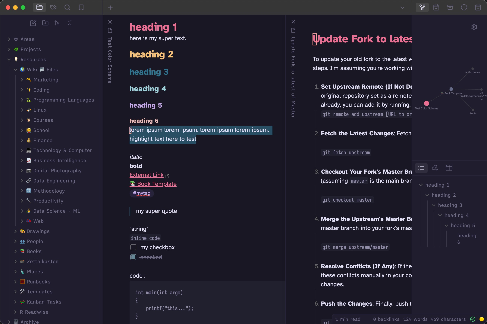

# Rosé Pine (Obsidian Theme)
This is a [Rosé Pine](https://github.com/rose-pine/rose-pine-theme) theme for [Obsidian](https://obsidian.md/). It supports dark and light.

Installation: Simply search `Rosé Pine` in the Obsidian Communitiy Themes and Install. Or if manually, copy the `theme.css` file to your vault directory and reload Obsidian for it to take effect.


## Rosé Pine


## Rosé Pine Dawn:


### Color Palette
* [Color Palette](https://rosepinetheme.com/palette/ingredients/)


### Bump Version

```sh
npm run version
```

---

*Check also my other Theme I created, [Kanagawa](https://github.com/sspaeti/obsidian_kanagawa), [Kanagawa Paper](https://github.com/sspaeti/obsidian_kanagawa_paper/).*
